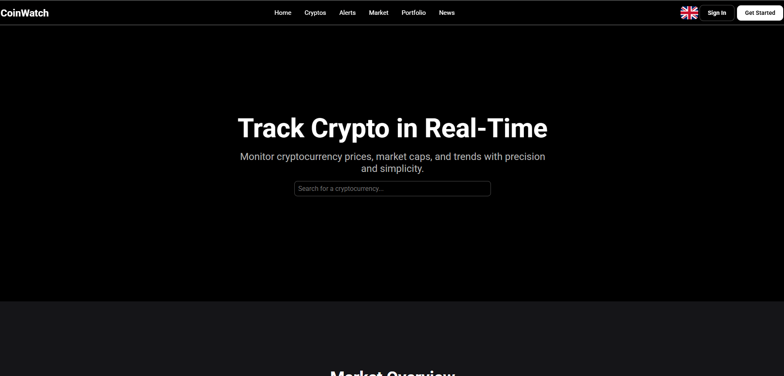

# CoinWatch

**CoinWatch** is an advanced cryptocurrency monitoring service designed for power users who want real-time insights, personalized alerts, and deep market analysis tools.

## 🚀 Features

- 📈 **Live crypto price tracking**
- 💡 **Advanced analytics and market insights**
- ⭐ **Favorites list** – track your selected coins
- 🚨 **Real-time alerts** for significant price movements
- 🧠 **Planned**: Crypto market simulator for strategy testing

## 🛠️ Tech Stack

CoinWatch is built with a modern and scalable stack:

- **Backend**: Spring Boot, GraphQL, Redis, Kafka, WebSockets (SockJS)
- **Frontend**: React, Redux, Apollo Client
- **Database**: PostgreSQL + TimescaleDB
- **Infrastructure**: Docker, Kubernetes (planned)
- **APIs**: [CoinGecko](https://www.coingecko.com/en/api) for live market data

## 🖥️ Preview

Here’s a quick look at the CoinWatch interface:

## ⚙️ Development Status

This project is actively developed and constantly evolving. Future plans include:

- Market simulation tools
- Deeper analytics dashboards
- More powerful alert and notification options

---

Stay tuned – CoinWatch is just getting started.